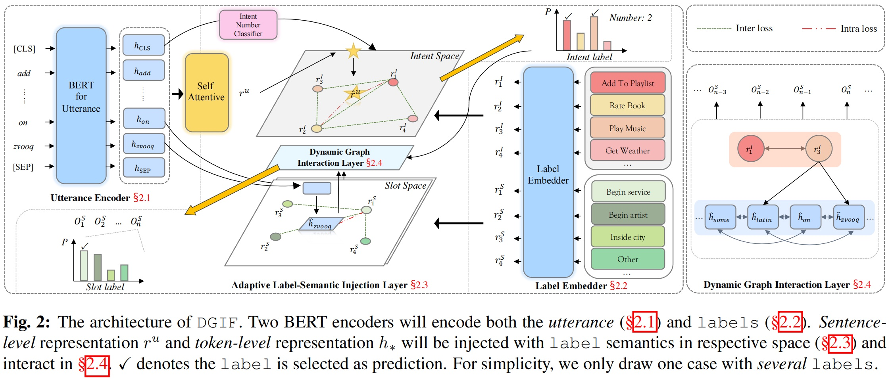

# A Dynamic Graph Interactive Framework with Label-Semantic Injection for Spoken Language Understanding

 

This repository contains the PyTorch implementation and the data of the paper: 
> **A Dynamic Graph Interactive Framework with Label-Semantic Injection for Spoken Language Understanding** 
>
> Zhihong Zhu, Weiyuan Xu, Xuxin Cheng, Tengtao Song, [Yuexian Zou](https://scholar.google.com/citations?user=sfyr7zMAAAAJ&hl=zh-CN&oi=ao)
> 
> ***ICASSP2023 [Under review]***.

This code has been written using PyTorch >= 1.12.0. If you use any source codes or the datasets included in this toolkit in your work, please cite the following paper. The bibtex are listed below:

<pre>
@article{zhu2022dgif,
  author    = {Zhihong Zhu and
               Weiyuan Xu and
               Xuxin Cheng and
               Tengtao Song and
               Yuexian Zou},
  title     = {A Dynamic Graph Interactive Framework with Label-Semantic Injection
               for Spoken Language Understanding},
  journal   = {CoRR},
  volume    = {abs/2211.04023},
  year      = {2022},
  url       = {https://doi.org/10.48550/arXiv.2211.04023},
  doi       = {10.48550/arXiv.2211.04023},
  eprinttype = {arXiv},
  eprint    = {2211.04023},
  timestamp = {Wed, 09 Nov 2022 17:33:26 +0100},
  biburl    = {https://dblp.org/rec/journals/corr/abs-2211-04023.bib},
  bibsource = {dblp computer science bibliography, https://dblp.org}
}
</pre>

## Update

- **[24 Oct 2022]** The code will be released soon since it is currently under review.

## Abstract

Multi-intent detection and slot filling joint models are gaining increasing traction since they are closer to complicated real-world scenarios. However, existing approaches (1) focus on identifying implicit correlations between utterances and one-hot encoded labels in both tasks while ignoring explicit label characteristics; (2) directly incorporate multi-intent information for each token, which could lead to incorrect slot prediction due to the introduction of irrelevant intent. In this paper, we propose a framework termed DGIF, which first leverages the semantic information of labels to give the model additional signals and enriched priors. Then, a multi-grain interactive graph is constructed to model correlations between intents and slots. Specifically, we propose a novel approach to construct the interactive graph based on the injection of label semantics, which can automatically update the graph to better alleviate error propagation. Experimental results show that our framework significantly outperforms existing approaches, obtaining a relative improvement of 13.7% over the previous best model on the MixATIS dataset in overall accuracy.

## Dataset

Please visit https://github.com/LooperXX/AGIF/data to get the dataset [MixATIS](https://github.com/LooperXX/AGIF/tree/master/data/MixATIS) & [MixSNIPS](https://github.com/LooperXX/AGIF/tree/master/data/MixSNIPS) and put them into ``./data`` folder.

## Model

## Contact us

- Just feel free to open issues or send us email([Zhihong](mailto:zhihongzhu@stu.pku.edu.cn)) if you have any problems or find some mistakes in this work.
